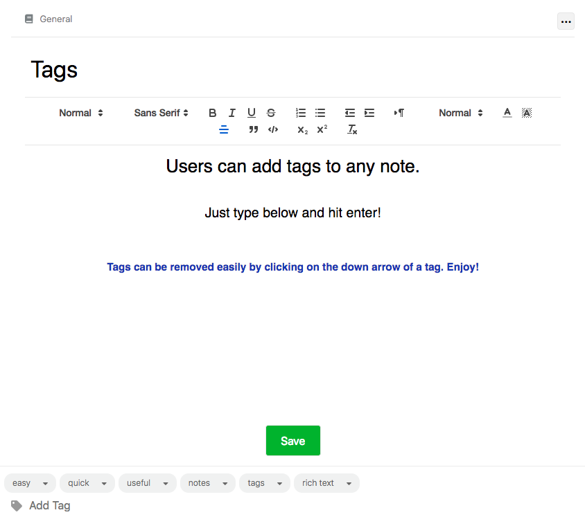

# JustNote

[JustNote](https://just-note.herokuapp.com) is a single-page clone of [Evernote](https://evernote.com/), a web application used to create and edit rich text formatted notes to help you stay on top of all the many parts of your life!

## Technologies
JustNote uses React, Redux, and ES6 to generate the frontend of the app and Ruby on Rails, with an SQL database to manage data on the backend.

## Home Page

# Key Features

## User Authentication

Users can easily and securely log in or sign up to access their account.

## Notes

Users can organize their thoughts into notes that they can create, edit, and delete. They can format their text using rich text formatting.

## Notebooks

Users can organize their notes into notebooks. Notebooks can be created, renamed, and deleted. Users can filter notes based on a notebook.

## Tags

Users can place multiple tags on notes. They can remove tags from individual notes, or delete a tag from all their notes. They can filter notes based on a tag.

## Easy UI

React and Redux create a simple and intuitive user interface. Users can easily navigate to where they want to go.

### Future features:
1. Auto-save
2. Search notes